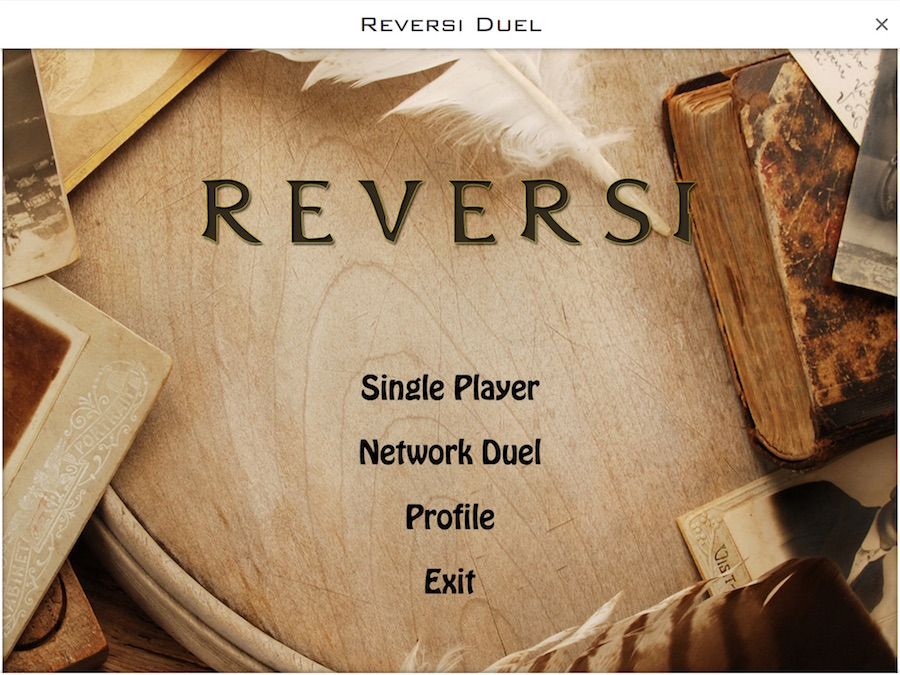
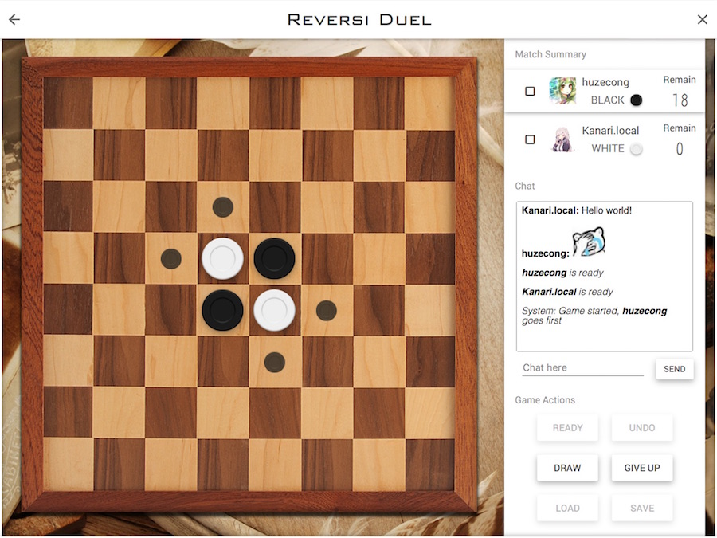
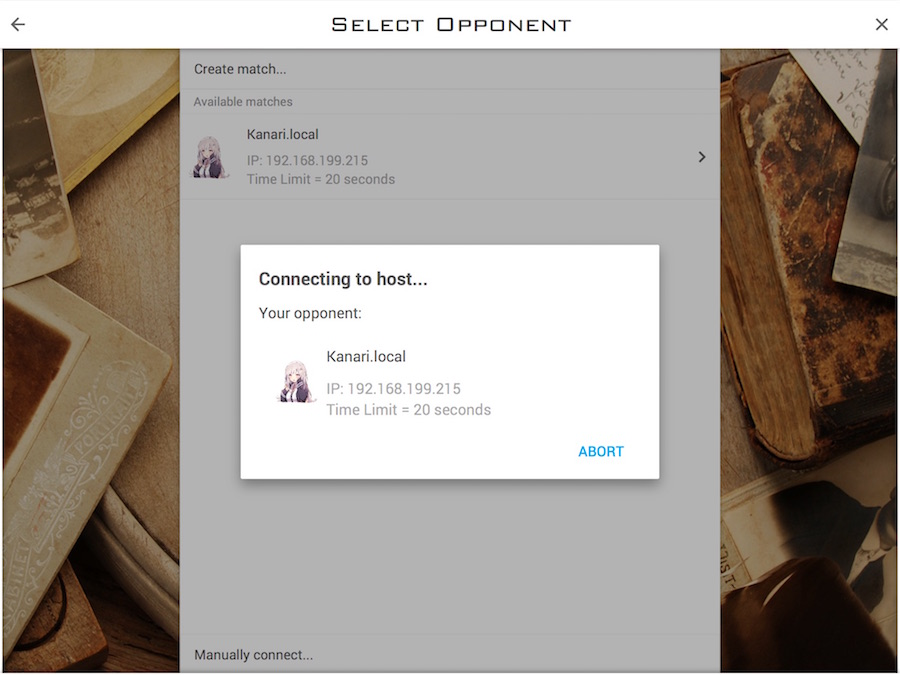
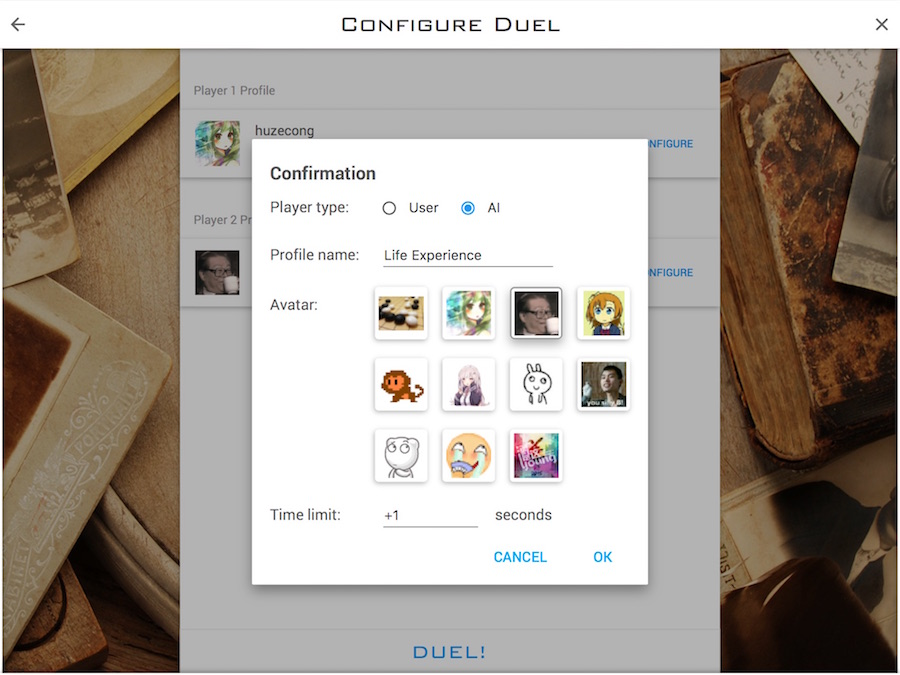

# ReversiDuel

A Java clone of **GomokuDuel**, except that Gomoku's changed to Reversi.

I tried to make this "clone" as similar to its original as possible, but due to framework limits differences exist. Also, there are enhancements and new features compared to the original version.

This project is based on JavaFX 8. Below is a list of third-party frameworks used:
- JFoenix: https://github.com/jfoenixadmin/JFoenix
- DataFX 8: https://bitbucket.org/datafx/datafx/
- Material Icons 2.2.0: https://bitbucket.org/Jerady/fontawesomefx

### Build Instructions

To build this project, simply run: 

```bash
./gradlew runApp
```
In case you're using Windows, change `./gradlew` into `gradlew.bat`.
(Gradle processes could take really long, please have patience and make sure you aren't blocked by firewalls)

To compile a JAR executable, run
```bash
./gradlew buildJar
```
This operation cannot be executed under Windows because a Bash script is run during the process.
The compiled JAR will be copied to project root, and then patched using script `fix-jar-build.sh`.
The patch step is necessary due to errors in the manifest file for DataFX.

You can run the JAR executable by
```bash
java -jar <JAR file>
```

### Screenshots

Main menu:



Game board:



LAN match discovery:



Player profile configuration:


