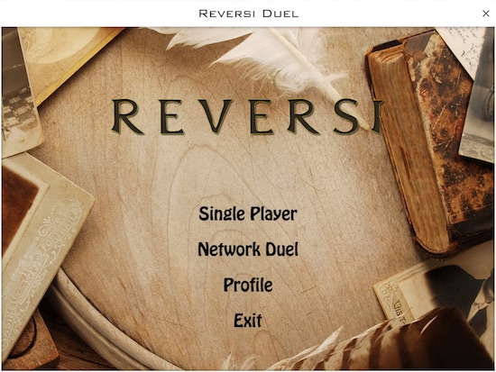
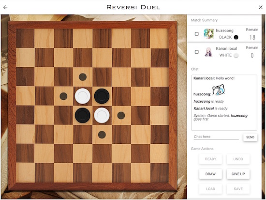
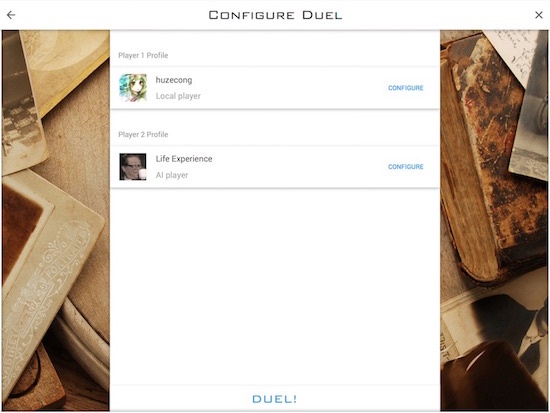
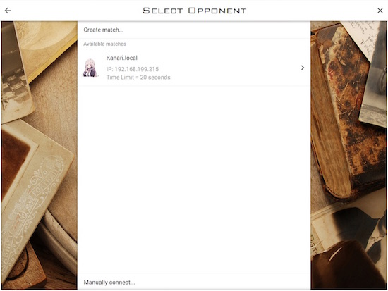
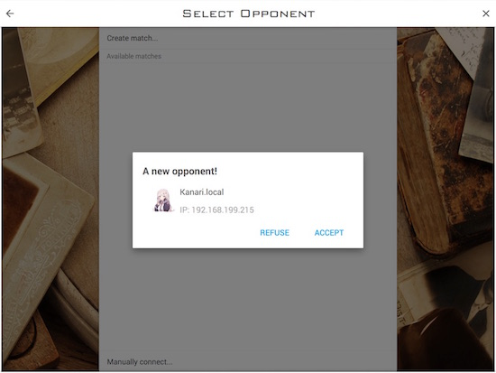
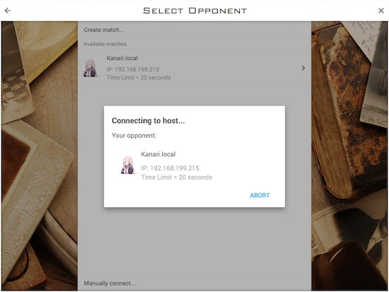
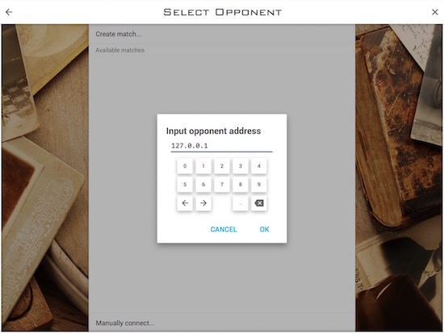
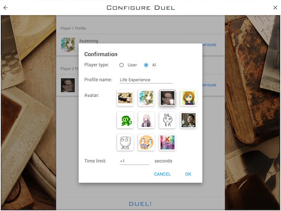
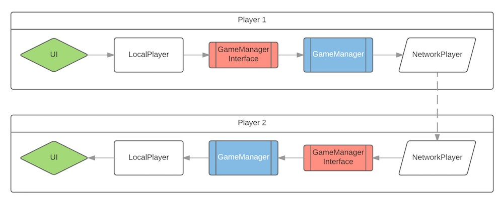

# Java程序设计大作业 - 黑白棋：设计报告

## 项目简介

### 开发工具与框架

本项目在开发过程中使用IntelliJ Idea 2016.2作为IDE，使用Gradle进行构建。图形界面基于JavaFX框架，代码中使用了下列开源库：

- JFoenix: https://github.com/jfoenixadmin/JFoenix
- DataFX 8: https://bitbucket.org/datafx/datafx/
- Material Icons 2.2.0: https://bitbucket.org/Jerady/fontawesomefx

本项目的代码已经在GitHub上开源，请访问https://github.com/huzecong/ReversiDuel查看。

### 构建方法

本项目可以在任意安装了恰当版本的JDK和JRE的系统上编译执行。只需在项目根目录运行：

```bash
./gradlew runApp
```

即可（Windows用户需要将`./gradlew`替换为`gradlew.bat`）。不过，Gradle运行较为缓慢，而且需要联网下载依赖库，视情况而定可能还需要科学上网。

使用Gradle还可以构建JAR可执行文件。同样在根目录下执行：

```bash
./gradlew buildJar
```

即可。由于需要运行自定义的Bash脚本，JAR的构建只能在\*nix系统下执行。

### 游戏界面

本项目的界面大致遵循Google Material Design设计风格，各控件尽量设计成了扁平化的样式。游戏的主菜单界面如下：



四项菜单项分别为：单机对战、网络对战、玩家信息设置，以及退出程序。

游戏的主界面如下：



最上面一栏为标题栏，左侧的箭头为返回按钮，右侧的叉则为关闭按钮。主界面左侧为游戏棋盘，右侧则为操作栏。操作栏分为三个部分，分别是游戏状态、聊天窗口，与操作按钮。

游戏状态区域显示了双方玩家的状态，在一名玩家的状态中，最左侧的数字为玩家的分数，中间为玩家的头像、昵称，以及执棋颜色，右边为玩家这一轮剩余的是考时间。当前正在操作的玩家会突出显示。

玩家可以通过聊天窗口即时与对方交流。同时，游戏开始、请求悔棋之类的操作也会以系统消息的形式显示在聊天窗口中。

操作按钮有留个，按照从上到下、从左到右的顺序分别是：准备开始、悔棋、申请平局、人数、载入局面，和保存局面。载入和保存局面仅在单机对战中可用，剩下的四项操作，除了准备开始”外，每项均需要对方确认方可执行。

### 单机对战

下图中为单机对战前的配置界面。用户可以在这一界面设置对战双方的信息。游戏支持双人对战、人机对战，以及双AI对战。



### 搜索对战

本项目实现了局域网内的对战搜索功能，类似于一些网络游戏中的“房间”功能。下图为搜索对战的界面，列出了当前局域网中可以加入的对战，以及对战的信息，包括对手头像、昵称、IP地址，以及游戏的回合时间限制。



用户可以通过单击“Create match…”按钮创建对战。创建对战的一方为服务端。在有客户端尝试连接到服务端时，服务端会显示该玩家的信息，并询问用户是否要与其对战，如下图所示。用户可以选择同意或者拒绝，若同意则开始游戏，拒绝则继续等待下一名玩家。



而未创建对战时，程序则是客户端。此时程序会自动收缩局域网内创建了对战的服务端，并以列表的形式显示。用户可以通过单击相应对战来发出加入请求，如下图所示。用户也可以通过单击对话框中的“Abort”按钮放弃加入。如果对方接受了请求，则开始游戏，否则会弹出对话框提示用户。



如果在加入对战、确认连接的任意一个步骤中，有一方取消连接、断线，或者响应超时，都将显示错误信息并拒绝加入对战。

当然，用户也可以通过手动输入IP地址的方式加入对战。在进行跨网域的对战时，通常只能通过这一方法加入对战。用户可以直接输入IP地址，也可以使用软键盘进行输入。界面如下图所示。



### 用户信息

用户可以设置自己的昵称与头像。目前头像只能从预设的11张图片中挑选。此外，用户还可以设置游戏的回合时间限制，以及玩家是否是AI。界面如下图所示。



用户信息设置的界面可以通过主菜单的“Profile”项进入，也可以在单击对战的界面中设置。用户自己的信息会成为单机对战中Player 1的信息。双方信息的配置以程序设置的形式保存，不会因为关闭程序而丢失。

值得一提的是，如果将用户自己设置为了AI，仍然可以进行网络对战。这时将由AI代替用户与网络上的对手进行对战。

有关回合时间限制，详细说明如下。在联网对战中，游戏的回合时间限制以服务端的设置为准；在单机对战中，双方玩家可以有不同的时间限制，可以在配置界面分别进行设置。

## 设计与架构

### 模块划分

本项目将各类按照所述功能分成了若干包（package），对应着项目中的各个模块。各模块列表如下：

- **逻辑模块（logic）：**包含游戏的数据模型（model），负责游戏的逻辑处理，以及双方玩家的请求响应；
- **网络模块（network）：**负责进行对战的搜索与连接，并提供了信息包装与校验的方法；
- **界面模块（ui）：**包含了各个不同视图（view）的控制器（controller）；
- **界面控件模块（ui.controls）：**包含了一些可复用的界面控件；
- **实用工具模块（util）：**包含了一些方便代码编写的工具类，如自定义的异常、对Timer类的包装等；
- **重载部件模块（override）：**包含了对所依赖的第三方库中并不尽人意的实现的改写。

在设计上，本项目尽可能实现了界面与逻辑的解耦合。界面控制器与逻辑部分仅通过预设的一些回调函数进行沟通。这样的设计虽然使得架构变得复杂，但是简化了代码编写，也增强了代码的可维护性。

### 系统架构

下面简要介绍游戏主界面中涉及到的各部分之间的交互与结构。以网络对战为例，程序需要处理这样的事件：用户做出的行动，经过逻辑部分处理之后，反映到界面上，同时通知到远端；远端发出的消息接收后，同样经过逻辑部分处理，反映到界面上，同时通知给用户。单机对战中无论是双人还是人机对战，也都是类似的流程。

基于这一相似性，本项目中为三类不同的玩家：用户（LocalPlayer）、AI（AIPlayer），以及网络另一端的玩家（NetworkPlayer）设计了共同的接口，即抽象用户类（AbstractPlayer）。这个类的子类需要实现在收到各类请求（如对方请求悔棋、平局等），或者发生各类事件（游戏开始、对方落子、游戏结束等）时玩家的操作。

AIPlayer的实现相对简单，只需要在恰当的时候计算落子即可。LocalPlayer由于需要用户进行响应，因此需要与界面的控制器交互。比如，当LocalPlayer收到悔棋请求时，会弹出对话框询问用户是否接受，并根据对话框的结果决定是否允许悔棋。注意此处的交互对于LocalPlayer的处理函数而言是阻塞的，而非在对话框关闭之时再通过回调函数通知结果。这一设计方便了代码的编写。

对于NetworkPlayer而言，事情就复杂一些了。在网络对战中，NetworkPlayer是对方的“代理”，因此需要将其受到的各类请求与事件发送给远端，同时从远端接收反馈；此外还需要接受远方发出的请求，并反馈回远端。因此在初始化时，NetworkPlayer需要和远端（或者说，和远方的NetworkPlayer实例）进行连接，并在必要时进行网络读写操作。注意此处虽然网络读写是在另一个线程进行的，但在处理请求等待反馈时仍然是阻塞的（即等到从网络读取到信息后才会继续执行）。

有了玩家的类之后，我们就需要找一个类来处理一切逻辑事物，这也就是GameManager类。这是一个十分庞大的类，因此此处不对其进行介绍，只需要知道它是“介于两个玩家之间的类”即可。即，玩家发出的请求会经过这个类处理，然后转发给另一名玩家。同时，游戏状态的记录与游戏流程的控制（开始、结束、载入、保存）也是交由GameManager处理的。

那么玩家如何与GameManager交互呢？GameManager中存储了两房玩家的AbstractPlayer实例，可以直接通过设定好的接口对玩家发出请求。但反过来，玩家如何向GameManager发出请求？由于黑白双方在一局游戏后会发生交换，让玩家告诉GameManager自己属于哪方显得有点冗余且越权。而且，有些东西也是不应暴露给玩家的。因此，本项目在此处又引入了一个GameManagerInterface类，由GameManager提供给玩家，玩家可以通过调用其中的接口来间接地向GameManager发出请求。同时，类中存储了玩家当前的执棋颜色，在一局结束后又GameManager控制修改。

至此我们已经可以完整描述一次请求的处理过程了。仍然以网络对战为例，下图中展示了从一方用户发出请求到另一方用户收到请求的整个流程：用户界面触发的事件由控制器转交给LocalPlayer，然后经由GameManagerInterface传递给GameManager，处理后转发给NetworkPlayer，然后经由网络发送给对方用户的NetworkPlayer，然后再走一遍上面的流程，最后反映到用户界面上。



这样的设计具有极强的可拓展性，只要遵循AbstractPlayer的接口，即可设计出各种各样的玩家，比如更强的AI玩家、使用其他协议进行通信的网络玩家，或者是使用外接控制器进行操作的用户。

设计的另一个好处是，由于所有需要双方处理的信息都通过网络进行传输，双方都拥有进行逻辑处理所需要的所有信息。这样所有的信息处理都可以在本地完成，而非在一个特定的服务端完成（虽然本项目中也分服务端和客户端，但这一区分只在加入对战时有所体现）。这样的设计也可以较为轻松地加入对观战者的支持。当然其坏处就是，双方必须严格保证信息同步，不然双方可能会处理出不同的结果。

### 用户界面设计

本项目的界面大致遵循Google Material Design设计风格，各控件尽量设计成了扁平化的样式。基于JavaFX的第三方库JFoenix提供了一些Material Design风格的基本控件，但在一些细节上没有按照Google给出的官方样式实现，一些控件的实现中还存在bug，因此项目对于其中一些进行了改写。override包中的CustomDialog、CustomRadioButton和CustomRippler均为对原有类（JFXDialog、JFXRadioButton，和JFXRippler）的改写。

本项目还使用了第三方库DataFX，它提供了类似于Android中Activity的在视图之间切换的模式。这个类中也存在一些bug，因此项目也对于其中一些类进行了改写。

JavaFX提供了以类XML语言描述界面的方法：FXML文件。在项目资源中可以找到所有界面对应的FXML描述，控制器的代码中则不包含布局设置与控件初始化（除一些不方便在FXML中定义的外），这些全部由JavaFX的注入（injection）完成。这也进一步分离了界面与逻辑。

本项目中没有使用系统自带的窗口样式，而是用基础控件重新实现了窗口及其拖拽、缩放操作。为了简化代码，此处的缩放被限定为等比例缩放。ui包中的BaseController为窗口及背景的控制器，其他所有界面都是这个界面中的视图。

各界面对应的控制器和FXML文件列表如下：

- **基础界面：**BaseController、Base.fxml；
- **主菜单：**MainMenuController、MainMenu.fxml；
- **单机对战配置界面：**LocalGameConfigurePageController、LocalGameConfigurePage.fxml；
- **单机对战游戏界面：**LocalDuelGameBoardController、GameBoard.fxml；
- **网络对战搜索界面：**ConnectPageController、ConnectPage.fxml；
- **网络对战游戏界面：**OnlineDuelGameBoardController、GameBoard.fxml。

值得一提的是，由于两个模式下的游戏界面的布局与交互逻辑有许多相似之处，因此它们的控制器继承自相同的抽象类AbstractGameBoardController。

### 网络通信

#### 用户信息

每个用户，无论客户端还是服务端，都存储了一个唯一的标识符，用来区分不同的用户。除此之外，程序还存储了用户的昵称和头像信息。用户可以更改昵称和头像（可以从给定的11个头像中挑选），但不能更改标识符。

### 搜索对战部分

搜索对战时使用的是UDP协议。使用UDP的原因是搜索对战时需要向局域网广播，且不需要对方确认收到，而并非向一个固定的 IP 建立可靠的连接。

搜索对战由MulticastManager进行控制。客户端与服务端均使用MulticastSocket监听一个固定的组播地址（224.0.0.87）的固定端口（8263）。服务端每隔1秒便会向这个地址的相同端口发送创建对战的消息。

客户端在收到消息后，会将信息转交给ConnectionManager进行处理。ConnectionManage会将服务端加入当前对战的列表中。在一个服务端加入列表后，如果2秒之内没有收到来自其的第二条消息（同样为创建对战的消息），则将该服务端从列表中移除。

客户端选择加入对战后，会尝试与服务端建立连接。由于从此开始要进行一对一的可靠连接，因此客户端会尝试建立TCP连接。客户端会先向服务端发送包含自己信息的消息。服务端接收消息后会询问用户是否接受，并将用户的回复发回给客户端。如果用户接受对战，则客户端会开始游戏，再次发送确认对战的消息给服务端，服务端收到后也会开始游戏。

每条消息均由SignaturedMessageFactory产生。正如名字所述，信息中包含了玩家的“签名”，即描述玩家的所有信息。每条消息包含以下信息:

- 消息发出的时间；
- 消息发送者的昵称；
- 消息发送者的头像编号；
- 消息发送者的唯一标识符；
- 消息发送者设定的回合时间限制；
- 消息发送者的 IP 地址；
- 消息的类型（“创建对战”、“加入对战”、“同意加入”、“拒绝加入”、“确认加入”）；
- 本项目的名称（”ReversiDuel“）。

只有除了消息类型和发出时间均完全一样的两条消息才会被视为从同一个用户发出的消息。消息的解析同样由SignaturedMessageFactory完成。

#### 游戏中部分

游戏中的网络连接使用的加入对战时使用的TCP协议。正如在系统架构部分中所述，这部分的网络处理全权由NetworkPlayer负责。消息的格式与上文相同，此处消息类型更多，包括以下9类：

- 请求悔棋，无附加信息；
- 请求认输，无附加信息；
- 请求平局，无附加信息；
- 落子超时，附加落子信息；
- 正常落子，附加落子信息；
- 准备开始，无附加信息；
- 发送聊天信息，附加聊天内容；
- 接受请求，无附加信息；
- 拒绝请求，无附加信息。

注意此处对于超时的处理。超时的玩家将进行一步完全随机的落子，并同样由网络传给对方。

当一方连接被断开、接受信息超时，或者收到格式不合法的消息时，会认为对方已经断线，直接结束游戏并弹出对话框。

## 总结

### 项目特点

- **美观的UI设计：**采用Material Design设计风格，并适当添加了动画效果，使得界面简洁却不失美感；
- **容错性强的交互：**充分考虑各种情况，采取保守策略，在出现各种异常的时候可以弹出错误对话框，并结束操作；
- **丰富的功能：**支持评分标准中提到的所有功能，此外还支持局域网对战搜索，以及用户信息的设定；
- **强可拓展性与可维护性：**架构的设计使得开发者可以轻松对已有代码进行修改或者拓展；
- **简单的构建流程：**使用gradle进行项目管理，实现“一键运行”。

### 开发流程

本项目开发共历时10天，其中各部分耗时如下：

- 前期调研、框架试用与选择：2天；
- 界面设计与实现：3天；
- 游戏部分架构设计与实现：2天；
- 网络部分实现：1天；
- 调试与用户体验优化：2天。

耗时为对该部分累计耗时的估计，以一天工作8小时粗略估算。

### 感想

其实在一开始，我对Java是不抱好感的。做小作业时的一些不好的体验，加之平时在网上看到的各种调侃Java的程序员笑话，给了我一种先入为主的坏印象。在当时的我的印象中，Java就是一门强制使用设计模式的、代码冗长的、执行缓慢的、没有优秀GUI框架支持的语言。

但随着对这门语言了解的深入，我接触到了JavaFX，接触到了一些成熟的Java项目，了解到了一些更高级的语言特性和更底层的语言实现，我慢慢觉得这门语言也有它的长处。设计模式是因为对于商业程序开发的定位；冗长是对于功能强大的妥协；执行缓慢是JVM跨平台带来的副作用；GUI方面，虽然使用不如Qt的QML语言方便，但也可以写出不输QML的界面。

总的来说，这次大作业是我做过的所有个人大作业中耗时最长，结果也最让我满意的一个。这个小学期也让我接触到了基础的Java开发，强化了我的开发能力。

感谢谌卫军老师的讲授，也感谢张晋玮助教的辛勤付出。